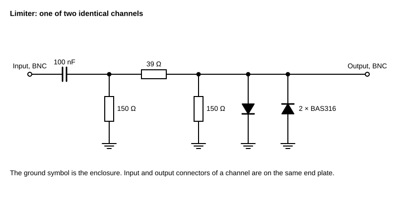
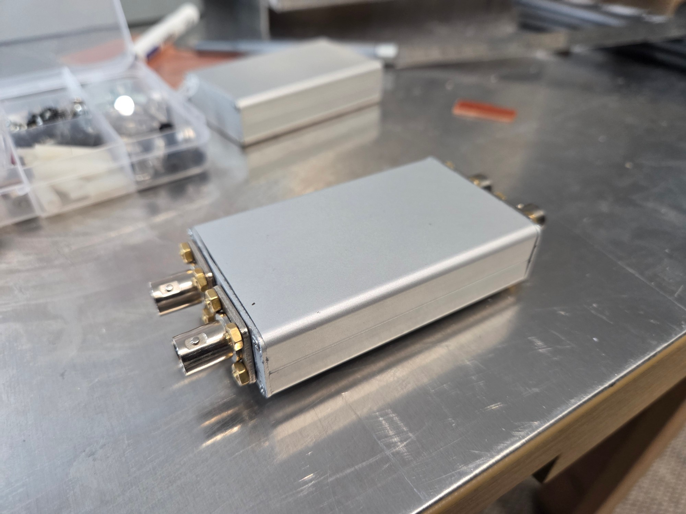
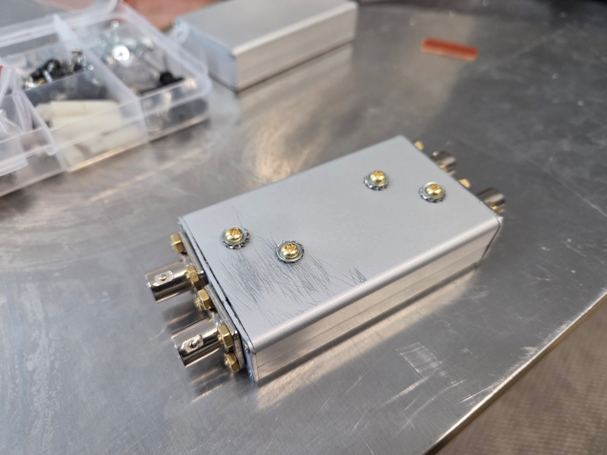
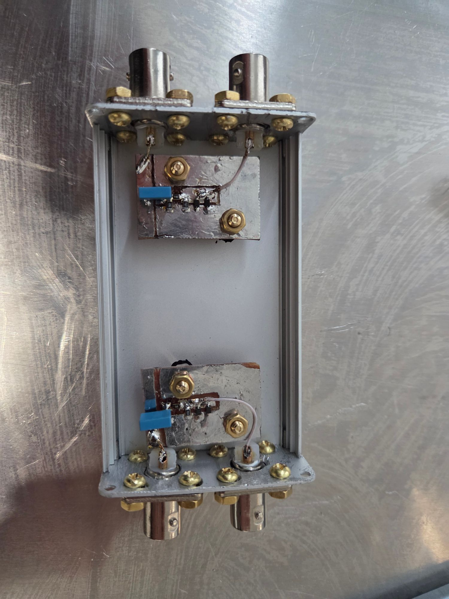
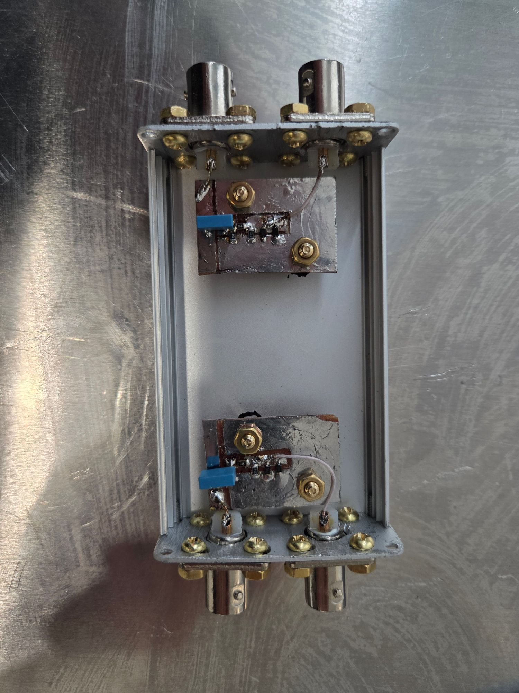
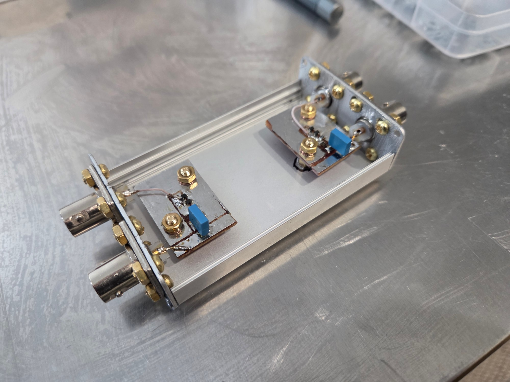
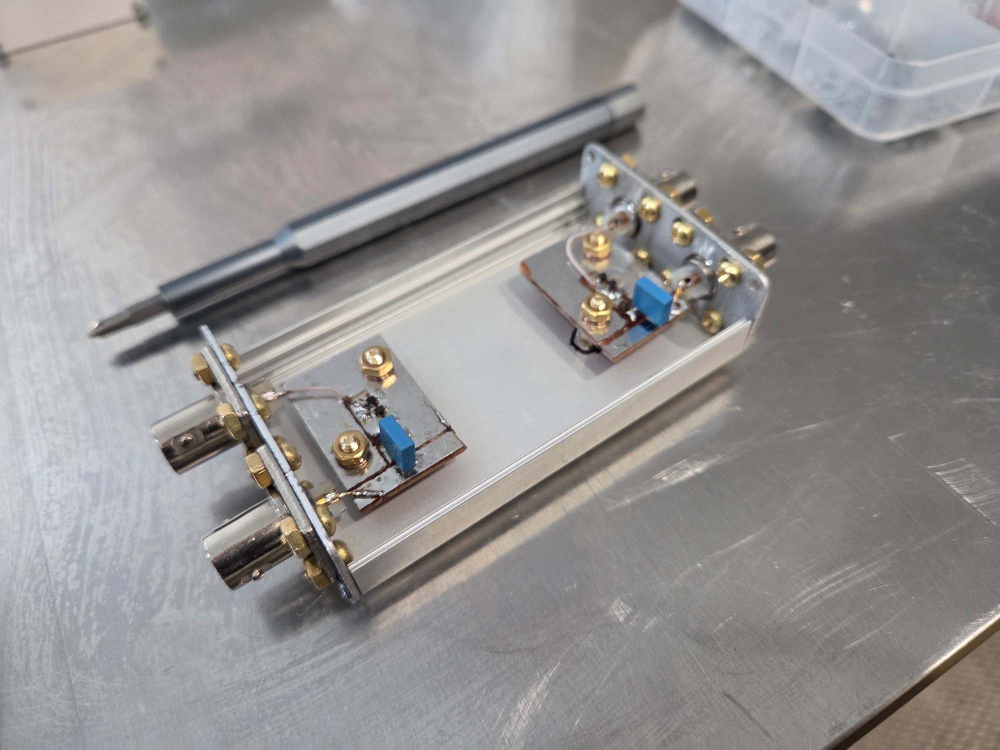

# Limiter (2 channels)

Channel circuit: BNC input → 100 nF capacitor → π-attenuator 150/39/150 Ω →
two anti-parallel diodes to the enclosure → BNC output.
Calculated attenuation 6.13 dB, calculated capacitor cut-off ≈16 kHz.

The two channels are identical and are placed at opposite ends of one enclosure, far from each other.
The input and output connectors of a channel are on the same end plate, so the leads to the board are as short
as possible. All four connectors are BNC; adapters are used where another connector type is needed.

Conditions: slot 0, both ports, the second channel terminated on both sides (BNC — 50 Ω feed-through load,
output — LOAD standard through an adapter). Instrument level ≈0.1 V, at the diodes after the attenuator ≈50 mV — the diodes are off,
the normal linear mode was measured.

## 3.1. Channel A

| Frequency | S21 input→output | S21 output→input | S11 of input | S11 of output |
|---|---|---|---|---|
| 10 kHz | −12.86 | −12.18 | −1.36 | −13.64 |
| 135 kHz | −6.14 | −6.12 | −18.17 | −30.37 |
| 1.009 MHz | −6.04 | −6.04 | −35.9 | −47.9 |
| 10.132 MHz | −6.05 | −6.05 | −42.82 | −43.1 |
| 30.004 MHz | see note | −6.09 | see note | −33.71 |
| 50 MHz | −6.15 | −6.14 | −27.5 | −29.23 |

Note: in the input→output direction at 30 MHz the recorded values are −13 / −1.31 dB — practically
the same as the 10 kHz row; the marker was probably on the first point. Expected ≈ −6.09 / −32.
To be checked against the video recording.

## 3.2. Channel B

| Frequency | S21 input→output | S21 output→input | S11 of input | S11 of output |
|---|---|---|---|---|
| 10 kHz | see note | −12.31 | see note | −13.58 |
| 135 kHz | −6.14 | −6.12 | −17.99 | −30.27 |
| 1.009 MHz | −6.04 | −6.04 | −35.64 | −49 |
| 10.132 MHz | −6.05 | −6.02 | −43.12 | −41 |
| 30.004 MHz | −6.09 | −6.10 | −32.37 | −31.57 |
| 50 MHz | −6.14 | −6.154 | −27.83 | −27.15 |

Note: at 10 kHz input→output the recorded values are −12.31 / −13.58 — digit for digit the same as in the reverse
direction; the row was probably copied twice. Expected ≈ −12.5 / −1.4.

## 3.3. Conclusions

- Attenuation 135 kHz – 50 MHz: channel A −6.04…−6.15, channel B −6.02…−6.15, with −6.13 calculated.
  Flatness ±0.05 dB, difference between channels up to 0.03 dB. **Into the corrections file: 6.1 dB ±0.05 for both channels.**
- Attenuation is the same in both directions (passivity check passed).
- The roll-off to −12.2…−12.9 at 10 kHz is the effect of the 100 nF capacitor and matches the calculated cut-off.
- Channel isolation **no worse than −85 dB** (instrument sensitivity limit). The first reading
  of −90…−100 dB was taken while the sweep had stopped and was discarded.
- Suspected cable damage was not confirmed: reverse measurements matched forward ones
  to hundredths of a dB.

## 3.4. Labelling error

The "input" and "output" labels on the enclosure had been applied the wrong way round; this was found from S11 at 10 kHz
(from the capacitor side ≈ −1.4 dB, from the opposite side ≈ −13.6 dB — a difference of 12 dB, that is,
a double pass through the 6 dB attenuator). The unit was built as described, with the capacitor at the input.
The labels have been corrected; the tables above are given with the correct assignment.

Diodes: BAS316, high-speed silicon switching diodes. Identified on 2026-10-01 from the package (looks like SOD323,
white cathode mark, marking A6) and the NXP "BAS16 series" datasheet (Rev. 05, 25 August 2008): BAS316 is the SOD323
type and its marking code is A6. Values from the datasheet: forward voltage max 715 mV at 1 mA and 855 mV at 10 mA,
capacitance max 1.5 pF at 0 V and 1 MHz, reverse recovery time max 4 ns.

Not established: the manufacturer of the diodes actually fitted (no access to the packaging).

## Photographs

Closed enclosure, top and bottom:

Opened, view from above: one board at each end, next to its two BNC connectors.

Opened, at an angle:

