# Electronic load

The load of the bench is of own design. This document describes how it is built and shows photographs
of its construction; it has no measurements of its own.

## Power path

- The input terminals go to a bridge rectifier. The shunt and the voltage pick-up for the panel meter are in the negative line;
  they are auxiliary and serve the indication only.
- After the rectifier, in the positive line: fuse, TVS diode, thyristor BT152-800R with its control circuit (below).
  From there the output goes to the transistors.
- 16 transistors IRFP150N on a common heatsink. Each transistor has a 1 Ω shunt in the source as a current sensor,
  10 kΩ between gate and source, and 220 Ω in the gate.
- A temperature sensor is fitted on the heatsink of the transistors; its display is on the front panel.
- Intended power: 300 W, with a good margin.

## Control of the transistors

Control is built on 4 integrated circuits LM324, 4 operational amplifiers in each: one amplifier per transistor.
All 16 channels are identical and receive the same control voltage.

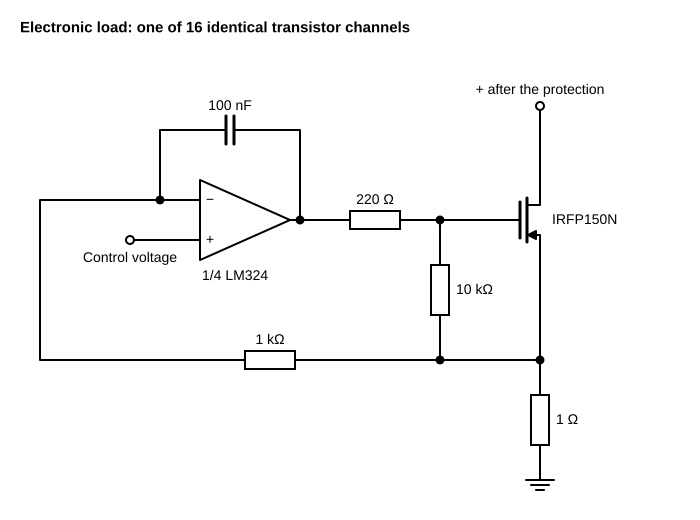

## Setting of the current

The control voltage is set by two 51 kΩ potentiometers on the front panel. The three amplifiers of this circuit
are in a fifth LM324.

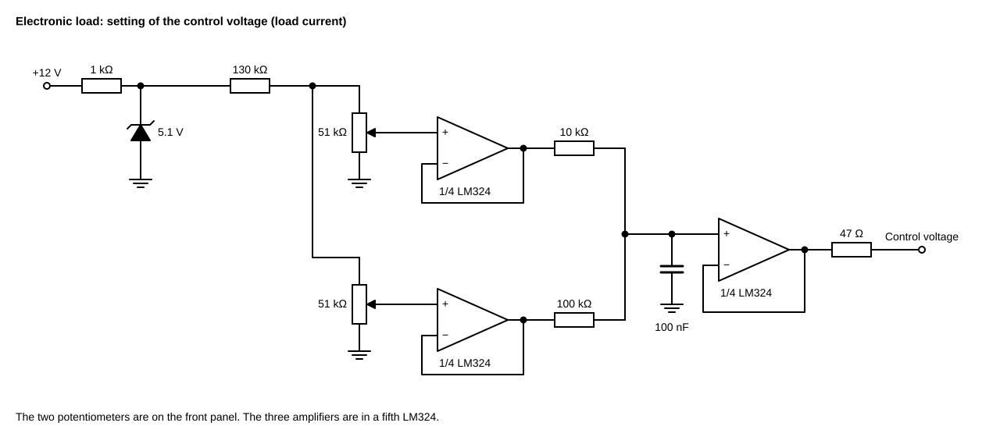

## Thyristor protection

The comparator LM393 monitors the voltage after the rectifier through the divider 33 kΩ / 2.7 kΩ and compares it
with a 5.1 V zener diode. Its output controls the field-effect transistor KP501B, which feeds the gate of the thyristor.

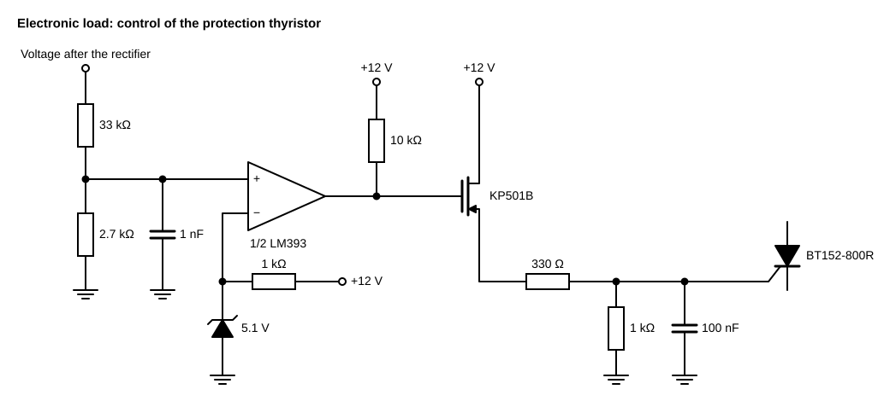

Calculated from the divider and the zener voltage: 5.1 V × (33 + 2.7) / 2.7 ≈ 67 V at the comparator threshold.
The threshold was not measured.

The driver originally had a KT3107 (PNP) instead of an NPN transistor: the circuit "inverted", with the base
near ground the thyristor turned on. It was replaced with the field-effect transistor KP501B,
with 330 Ω from its source to the gate of the thyristor and 1 kΩ from the gate to ground (see [error log](08-errors.md)).

## Internal supply

Transformer 220 V to 18 V, rectifier, capacitor. This output feeds the two cooling fans and a 12 V linear regulator;
all integrated circuits are powered from the regulator.

## Use in this stage

In the background measurement the load was used at currents up to 7 A, with leads of ≈1 m to the output terminal
of the LISN ([06-background-protocol.md](06-background-protocol.md)). The leads and the enclosure of the load acting
as an antenna are one of the interference sources found there.

## Not recorded

Complete circuit diagram of the power path; measured threshold of the protection; measured maximum voltage, current and power.

The schematics are redrawn from handwritten sketches.

## Photographs

Photographs of 12 August – 23 September 2026, in order of construction, cropped to the object.

### 12 August

Power stage before installation: 16 transistors in two rows of 8 on a common aluminium heatsink, each with its own source resistor connected to a copper bus.

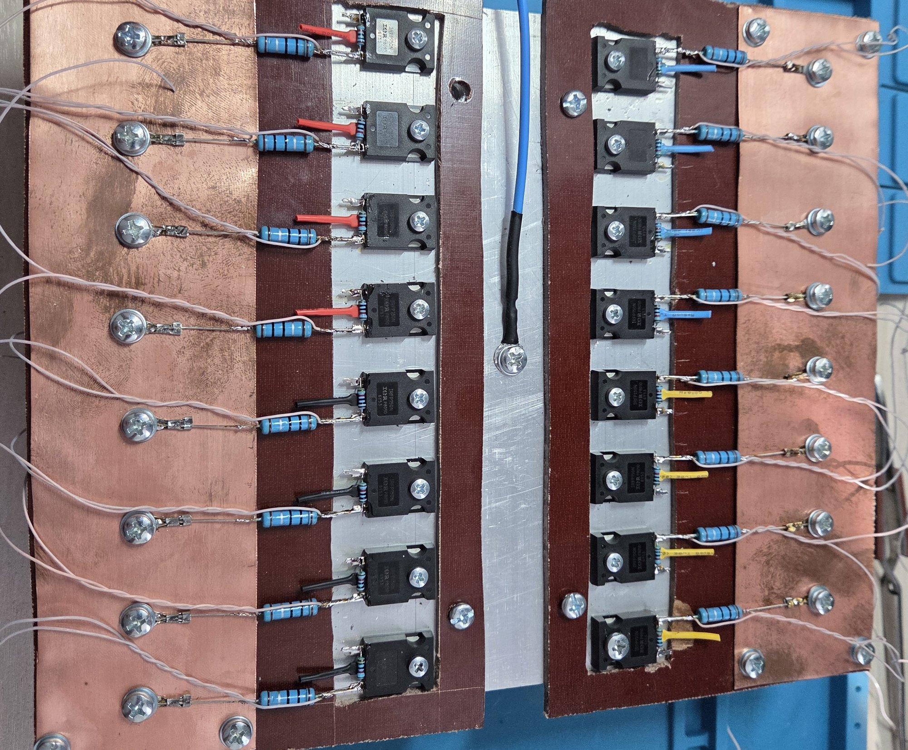

### 12 August

The same power stage from the other side. Marking on the transistors: IRFP150N.

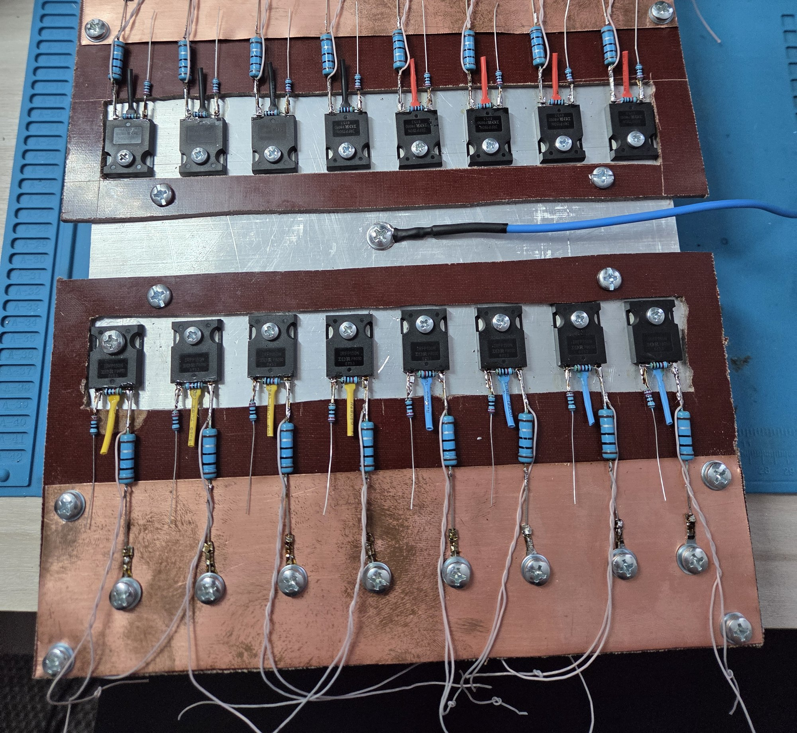

### 9 September

Power stage mounted in the enclosure, view from above: two fans at the perforated side panels, transistors numbered 1–16.

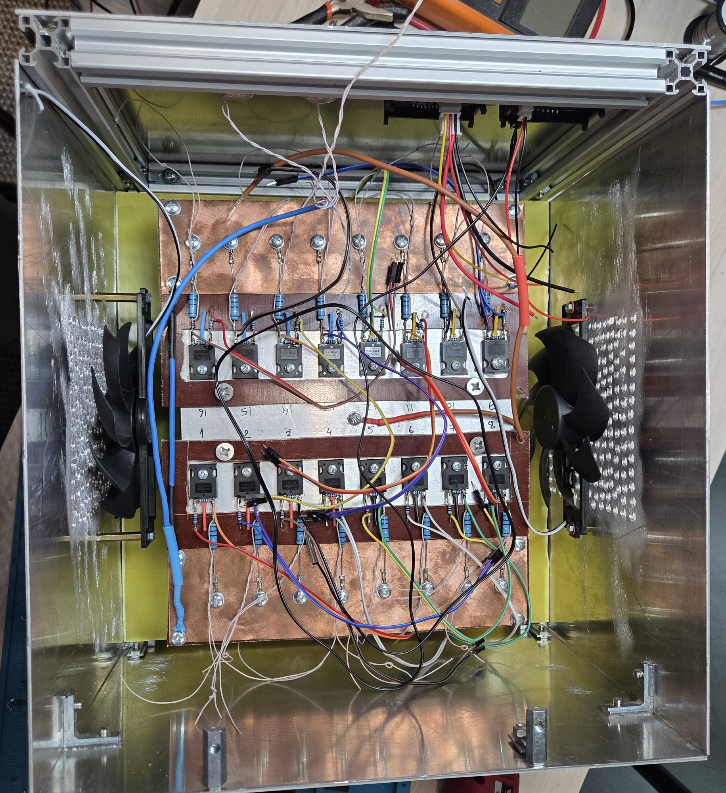

### 9 September

Enclosure from the outside: front panel and perforated side panel.

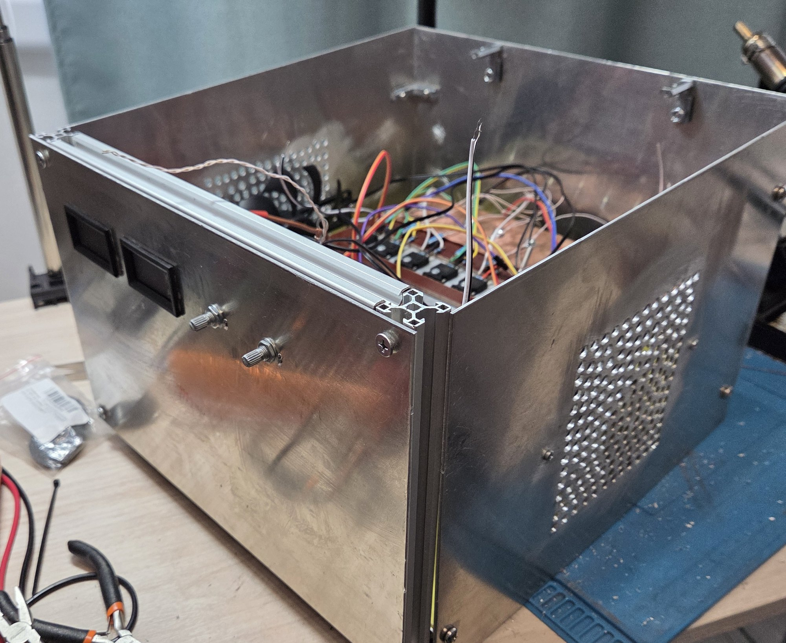

### 9 September

Front panel: two panel meters and two potentiometers.

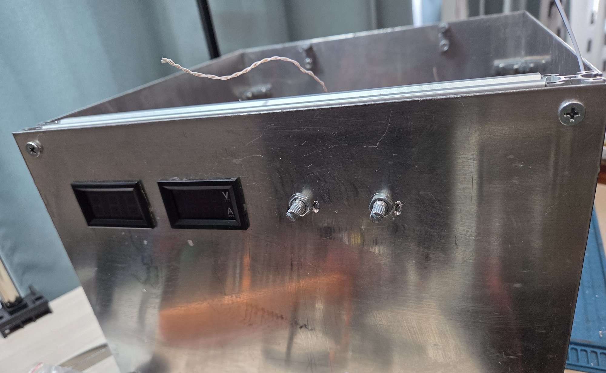

### 9 September

Enclosure with the power stage, view from above, front panel on the left.

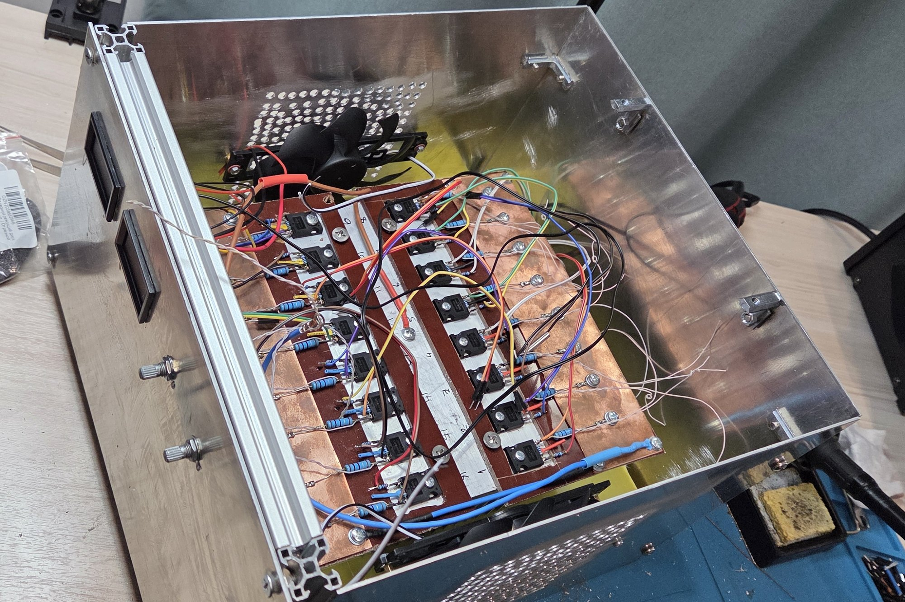

### 22 September

Before final assembly: the upper plate with the boards (top) and the power stage (bottom) laid out on the table.

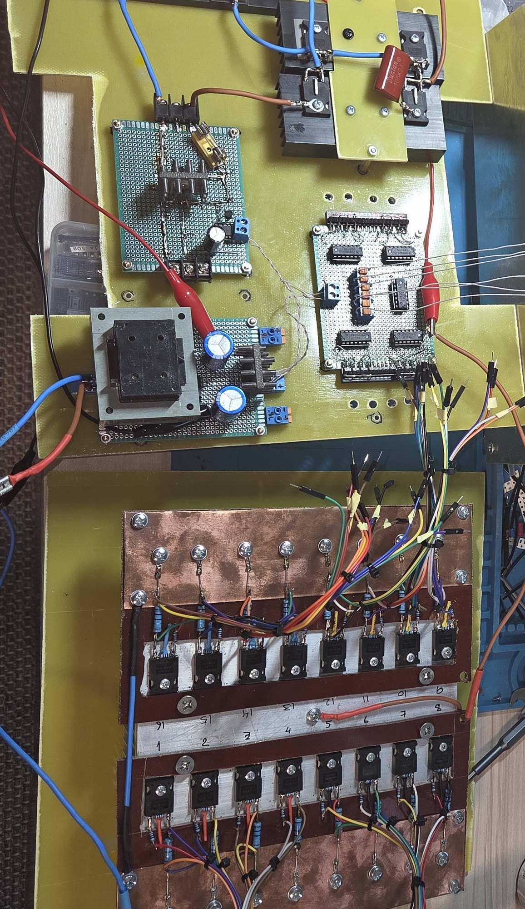

### 23 September

Side view with the side panel removed: the upper plate with the boards above, the power stage on its heatsink below.

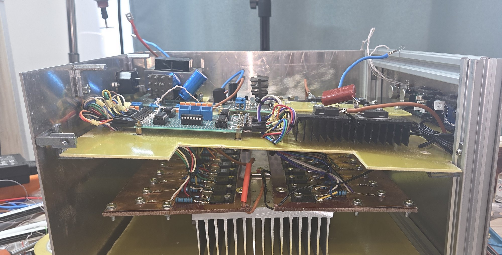

### 23 September

Assembled load, view from above, connected to the laboratory power supply (its display shows 18.3 V, 0.41 A).

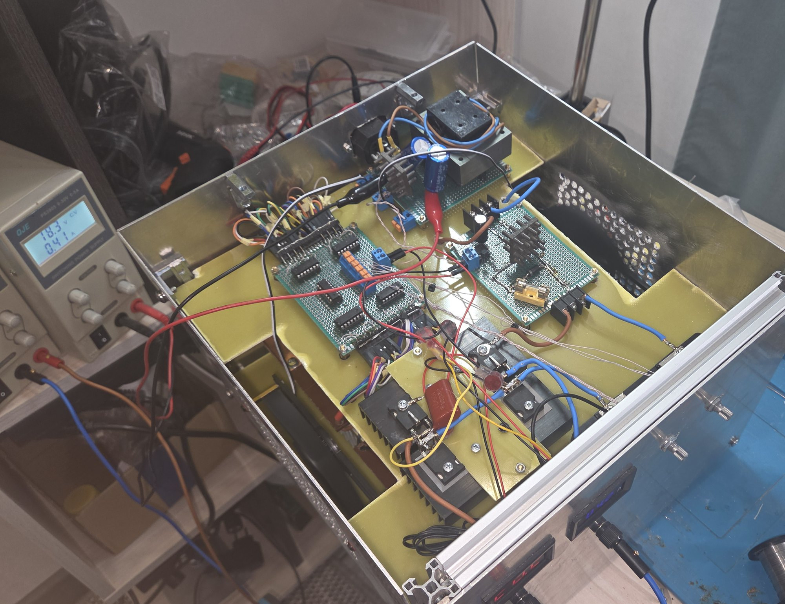
