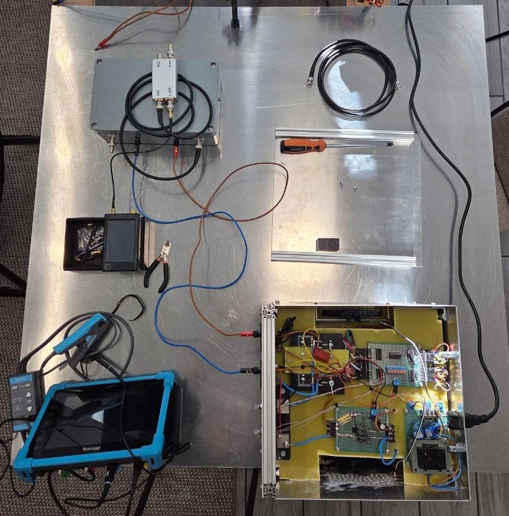

# Lab bench preparation

Stage uploaded 2026-09-26. Measurement sessions: 21, 22, 24 and 25 September 2026.
Everything in this folder was measured, except where it is explicitly marked as a calculation.

This stage accompanies the first video of the series.

## What the bench is

A home pre-compliance bench for measuring conducted emission on power lines
in the 150 kHz – 30 MHz band (voltage method, reference standard CISPR 25, automotive 12/24 V).
The purpose of the bench is not certification, but a repeatable "before and after" comparison
when reworking converter prototypes.

## Bench

View from above: the reference plate with the LISN and the limiter on top of it (upper left), TinySA Ultra (left),
oscilloscope (lower left) and the electronic load with its lid removed (lower right). The aluminium sheet with profiles
in the centre is the reference plane. The laboratory power supplies are
above the upper edge of the frame.

## Components

| Unit | What it is | State |
|---|---|---|
| Line impedance stabilisation network (LISN), 2 channels | 5 µH, 1 µF, 0.1 µF, attenuator 100/68/100 Ω, BNC | Built, measured |
| Limiter, 2 channels in one enclosure | 100 nF → attenuator 150/39/150 Ω → 2 anti-parallel diodes BAS316 → BNC | Built, measured |
| Electronic load | Own design, with protection (bridge, TVS diode, thyristor BT152-800R driven by comparator LM393, driver KP501B) | Built |
| Vector network analyser | NanoVNA-H4 rev 4.4 (ZeeTK mixer, hugen firmware based on DiSlord) | Calibrated |
| Spectrum analyser | TinySA Ultra | In use |
| Oscilloscope | Micsig TO1104 + 50 Ω feed-through load | Checked |

## Reference plate is not earthed

In this stage the plate on the bench is used as a common conductor and is **not connected
to protective earth**. This is a deliberate state of the bench at the time of the first video,
not an unfinished item. All results in this folder, including the background measurement,
were taken in this state.

This was done deliberately, in order to close the first series. The second series will begin with a more
thorough preparation of the bench itself: the background check without a prototype will be repeated,
this time with full earthing — the plate connected to protective earth and the enclosures
bonded to it (see [background protocol, section 6](06-background-protocol.md#66-rework-plan)
and [open questions](09-open-questions.md)).

## Errors and corrections

This section is a substantive part of the material, not an appendix.
The same table is kept in [08-errors.md](08-errors.md).

| Error | How it was found | Correction |
|---|---|---|
| The "input" and "output" labels on the limiter were swapped | S11 at 10 kHz differed by exactly 12 dB (double pass through the 6 dB attenuator) | Labels corrected, tables rearranged |
| The thyristor driver had a KT3107 (PNP) instead of an NPN | The circuit "inverted": with the base near ground the thyristor turned on | Replaced with KP501B (field-effect transistor), 330 Ω from its source to the thyristor gate, 1 kΩ from the gate to ground |
| First LISN measurement with one-metre banana-to-crocodile leads | Impedance kept rising without stopping (310 Ω at 30 MHz), the residual matched 2 Ω + 1.4 µH | Re-measured with short 2.5–3 cm conductors |
| TinySA grid reading error of 35 dB | The marker showed 36.6 dBµV, while the estimate from the grid gave 75 | All levels re-read from the screenshots, conclusions rewritten |
| Core dimensions in early notes (Ø100 mm, magnetic path 25 cm) | Marking 0077109A7 and physical measurement: 58 × 36 × 14 mm, path 14.3 cm | Inductance drop under current recalculated |
| First channel isolation reading −90…−100 dB | The instrument sweep had stopped, the picture was frozen | Re-measured: no worse than −85 dB |
| CISPR 25 limits quoted from memory with a 10 dB step between classes in every band | Check against GOST CISPR 25—2023, Table 6: the step is 10 dB only at 150–300 kHz, 8 dB at 0.53–1.8 MHz, 6 dB at 5.9–6.2 and 26–28 MHz | Limits table replaced, margin above 10 MHz recalculated: 18–23 dB for class 5 instead of "no margin" |

## Documents

| File | Contents |
|---|---|
| [01-nanovna-calibration.md](01-nanovna-calibration.md) | NanoVNA-H4 calibration: procedure, check, when a calibration is no longer valid |
| [02-scope-50-ohm-load.md](02-scope-50-ohm-load.md) | 50 Ω feed-through load for the oscilloscope |
| [03-limiter.md](03-limiter.md) | Limiter, both channels, labelling error |
| [04-lisn-inductor.md](04-lisn-inductor.md) | LISN inductor |
| [05-lisn.md](05-lisn.md) | LISN: channel check, comparison with the CISPR 25 curve, path correction |
| [06-background-protocol.md](06-background-protocol.md) | Bench background measurement protocol, steps 0–13 |
| [07-corrections.md](07-corrections.md) | Corrections file |
| [08-errors.md](08-errors.md) | Error and correction log |
| [09-open-questions.md](09-open-questions.md) | Open questions |
| [10-electronic-load.md](10-electronic-load.md) | Electronic load: power path, control, protection, photographs of its construction |
| [tinysa-screenshots/](tinysa-screenshots/) | TinySA screenshots, one per background step, with a legend |

## Terms used

| Term | Meaning |
|---|---|
| LISN | Line impedance stabilisation network: sets a defined impedance on the power line and gives a measurement output (BNC) |
| Input terminal | LISN terminal on the power supply side |
| Output terminal | LISN terminal on the side of the device being measured (the prototype) |
| Limiter | Unit between the LISN BNC output and the spectrum analyser: 100 nF capacitor, attenuator, two anti-parallel diodes to the enclosure |
| S11 | Reflection measured at port 1 of the vector network analyser |
| S21 | Transmission from port 1 to port 2 of the vector network analyser |
| RBW | Resolution bandwidth of the spectrum analyser |
| Reference plate | The plate on the bench, used in this stage as a common conductor |
