# TinySA screenshots

Background measurement of 25 September, one photograph of the TinySA Ultra screen per step. Step numbering matches the
[summary table](../06-background-protocol.md#62-summary-table) of the protocol.

The marker column gives the marker readout as shown on the screenshot. The marker is on the hump in the middle
of the band, not on the trace maximum. Levels are as shown on the screen; the correction column gives what is
added to obtain the level at the port of the standard LISN.

| File | Step | State | Correction to the port | Marker on the screenshot |
|---|---|---|---|---|
| [`step-00_load-7A-rbw-300k-no-limiter.jpg`](step-00_load-7A-rbw-300k-no-limiter.jpg) | 0 | Load 7 A, RBW 300 kHz, no limiter | +9.7 dB | 17.572 MHz, 48.7 dBµV |
| [`step-01_load-connected-power-off-psu-disconnected.jpg`](step-01_load-connected-power-off-psu-disconnected.jpg) | 1 | Load connected, its power off, power supply terminals disconnected | +9.7 dB | 17.633 MHz, 40.2 dBµV |
| [`step-02_psu-leads-connected.jpg`](step-02_psu-leads-connected.jpg) | 2 | Power supply terminals connected | +9.7 dB | 17.634 MHz, 42.2 dBµV |
| [`step-03_psu-on-6A.jpg`](step-03_psu-on-6A.jpg) | 3 | Power supply on, 6 A | +9.7 dB | 16.104 MHz, 41.2 dBµV |
| [`step-04_empty-lisn.jpg`](step-04_empty-lisn.jpg) | 4 | Empty LISN: neither power supply nor load | +15.8 dB | 26.872 MHz, 5.8 dBµV |
| [`step-05_load-wires-connected-power-off.jpg`](step-05_load-wires-connected-power-off.jpg) | 5 | Load leads connected, load power off | +15.8 dB | 805.0 kHz, 39.6 dBµV |
| [`step-06_load-control-and-fans-on.jpg`](step-06_load-control-and-fans-on.jpg) | 6 | Load control and fans on | +15.8 dB | 17.633 MHz, 41.7 dBµV |
| [`step-07_psu-connected-off.jpg`](step-07_psu-connected-off.jpg) | 7 | Power supply connected, off | +15.8 dB | 16.104 MHz, 40.7 dBµV |
| [`step-08_psu-on-6.5A.jpg`](step-08_psu-on-6.5A.jpg) | 8 | Power supply on, 6.5 A | +15.8 dB | 17.633 MHz, 42.7 dBµV |
| [`step-09_pc-off.jpg`](step-09_pc-off.jpg) | 9 | PC switched off (the rest as in 8) | +15.8 dB | 7.871 MHz, 36.6 dBµV |
| [`step-10_load-current-0.jpg`](step-10_load-current-0.jpg) | 10 | Load current 0 (by the regulator) | +15.8 dB | 7.994 MHz, 26.5 dBµV |
| [`step-11_psu-off-leads-connected.jpg`](step-11_psu-off-leads-connected.jpg) | 11 | Power supply off, terminals connected | +15.8 dB | 15.255 MHz, 22.8 dBµV |
| [`step-12_psu-leads-disconnected.jpg`](step-12_psu-leads-disconnected.jpg) | 12 | Power supply terminals disconnected | +15.8 dB | 17.508 MHz, 16.7 dBµV |
| [`step-13_load-power-off-wires-connected.jpg`](step-13_load-power-off-wires-connected.jpg) | 13 | Load power off, leads connected | +15.8 dB | 11.983 MHz, 2.4 dBµV |

Step 0 was taken with RBW 300 kHz and a grid of 0…+100 dBµV; steps 1–13 with RBW 10 kHz and a grid of −10…+90 dBµV.
The photograph for step 0 is taken from the session report and has a lower resolution (1000 × 750) than the others (1280 × 960).

The screen reflects the phone and the hand of the person taking the photograph; this does not affect the trace.

## Screenshots

### Step 0. Load 7 A, RBW 300 kHz, no limiter

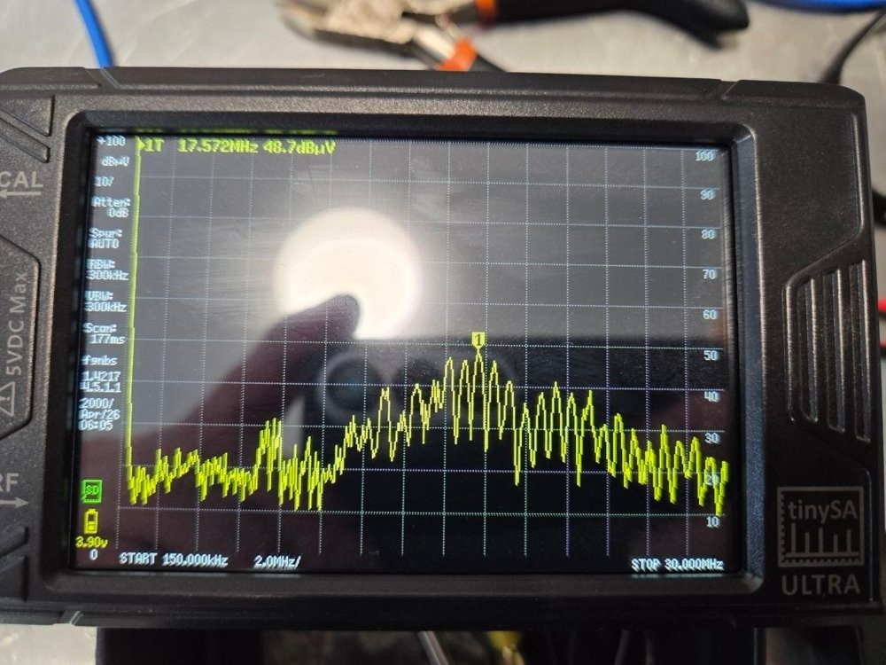

### Step 1. Load connected, its power off, power supply terminals disconnected

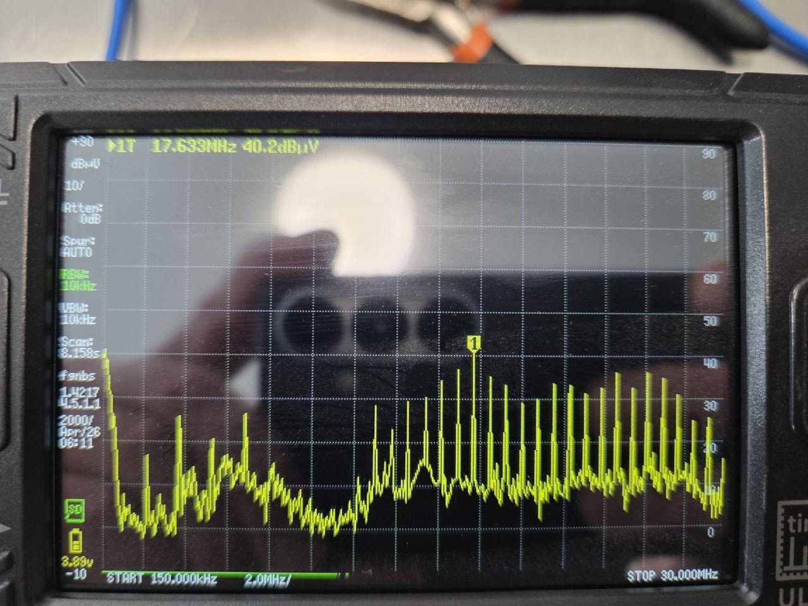

### Step 2. Power supply terminals connected

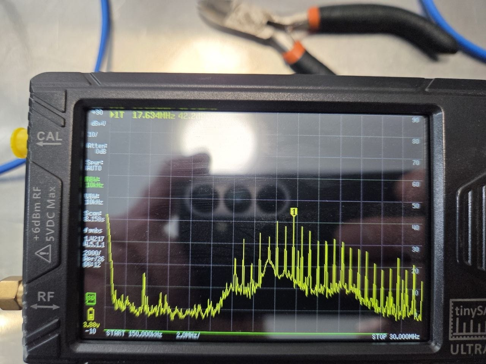

### Step 3. Power supply on, 6 A

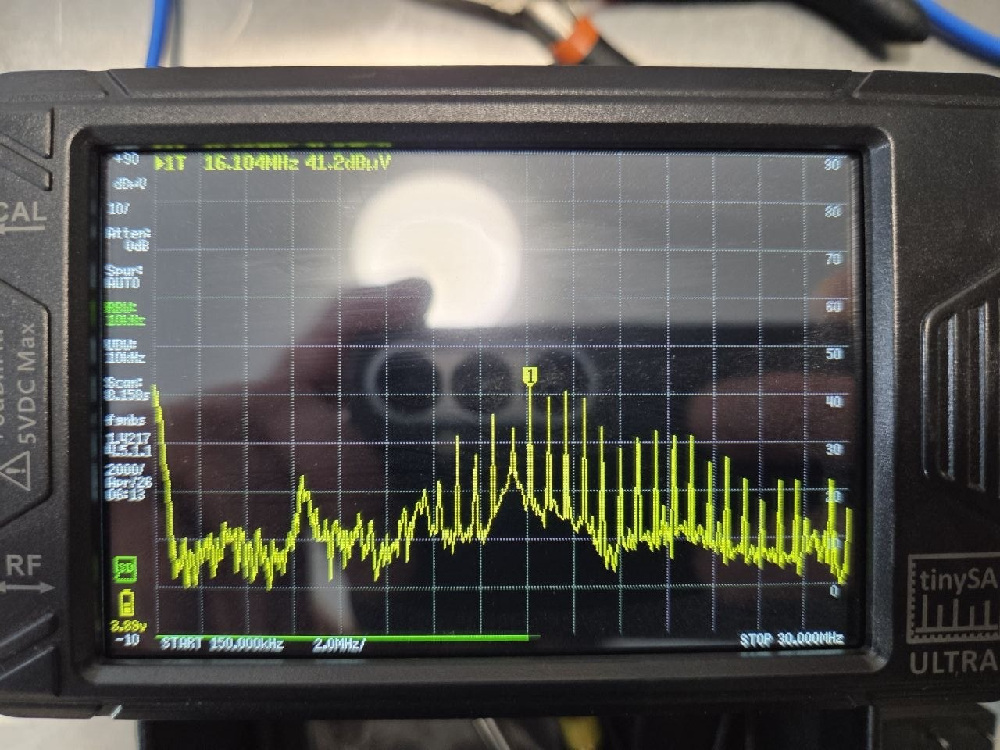

### Step 4. Empty LISN: neither power supply nor load

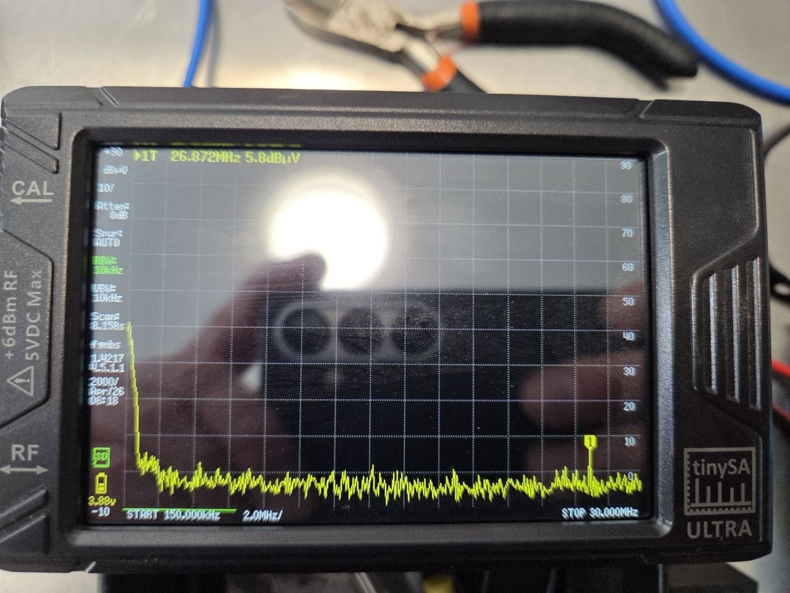

### Step 5. Load leads connected, load power off

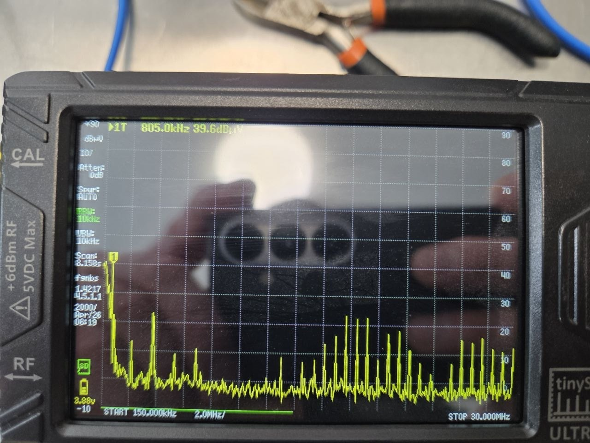

### Step 6. Load control and fans on

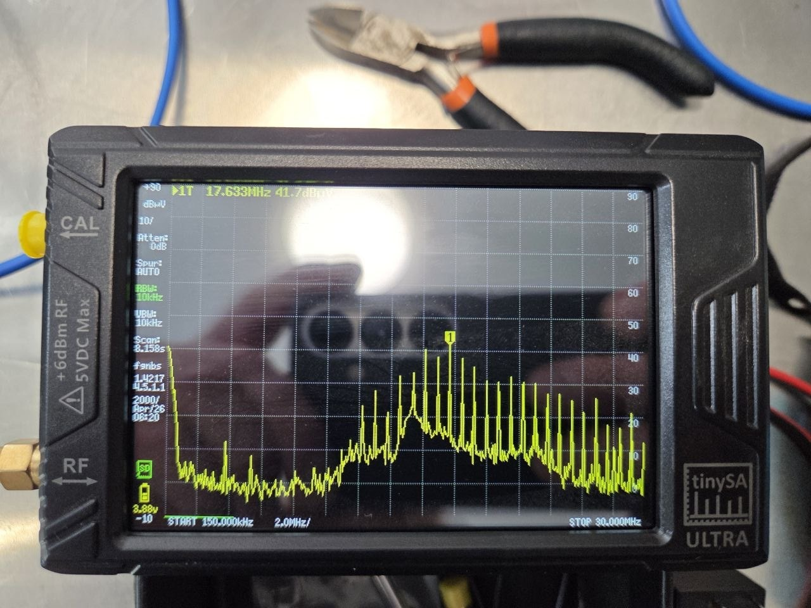

### Step 7. Power supply connected, off

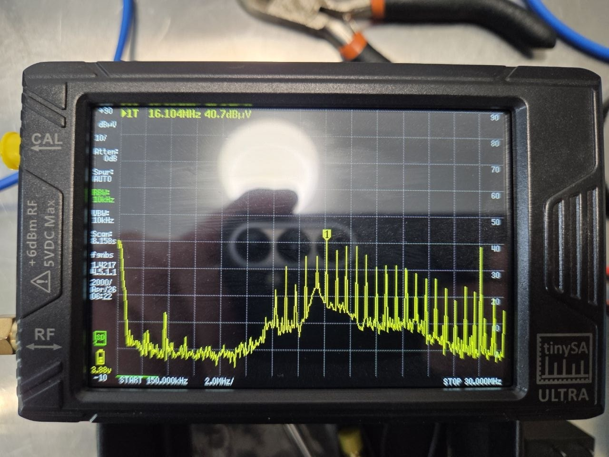

### Step 8. Power supply on, 6.5 A

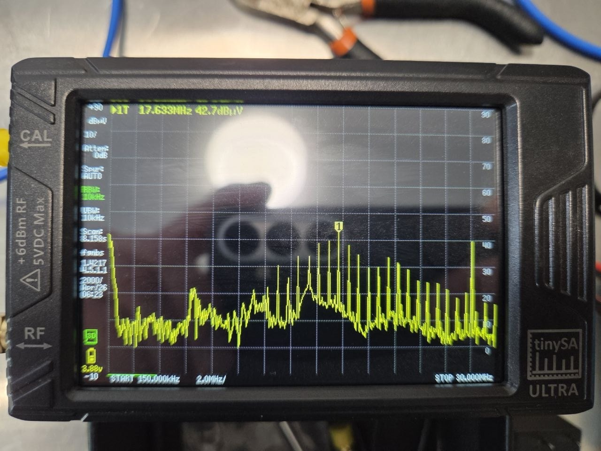

### Step 9. PC switched off (the rest as in 8)

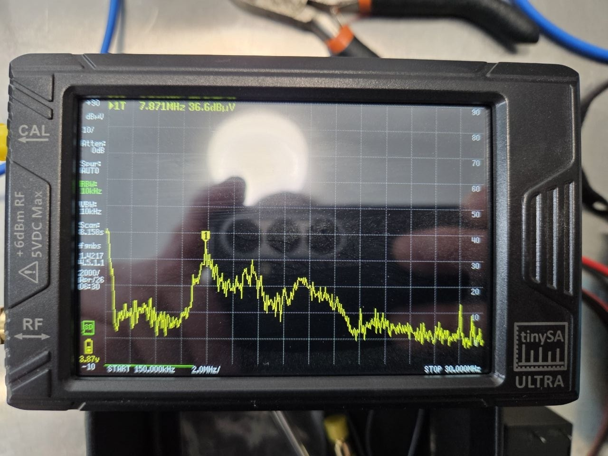

### Step 10. Load current 0 (by the regulator)

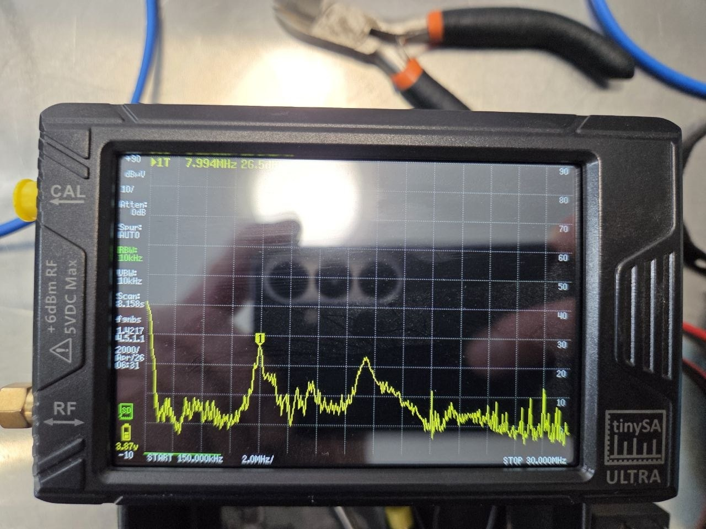

### Step 11. Power supply off, terminals connected

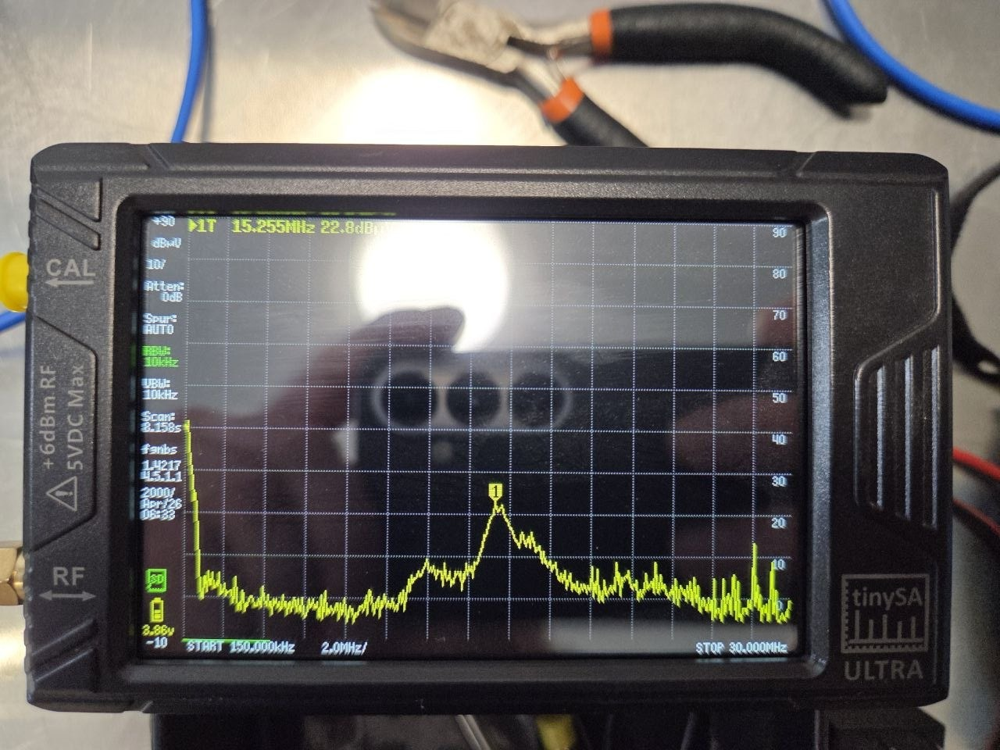

### Step 12. Power supply terminals disconnected

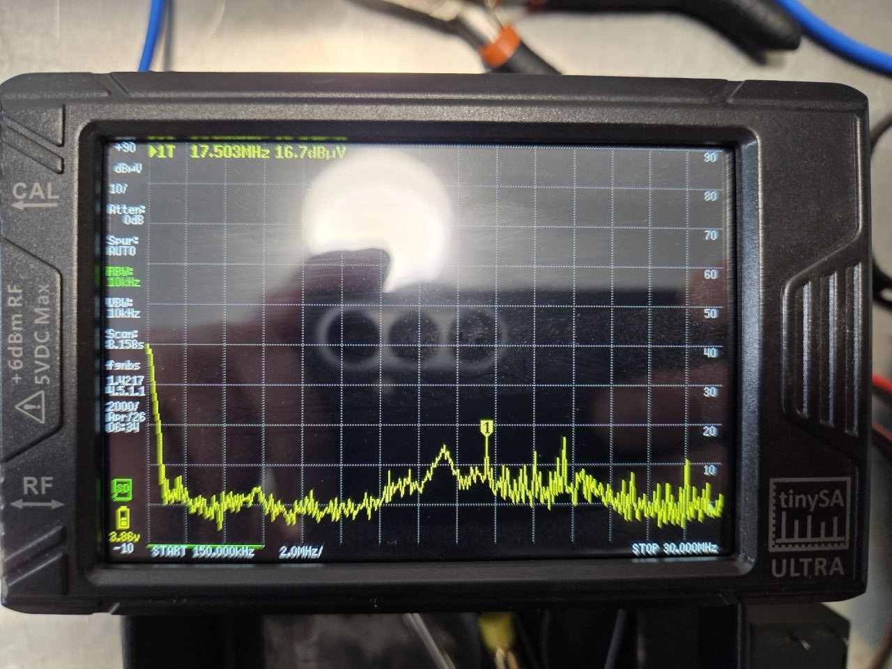

### Step 13. Load power off, leads connected

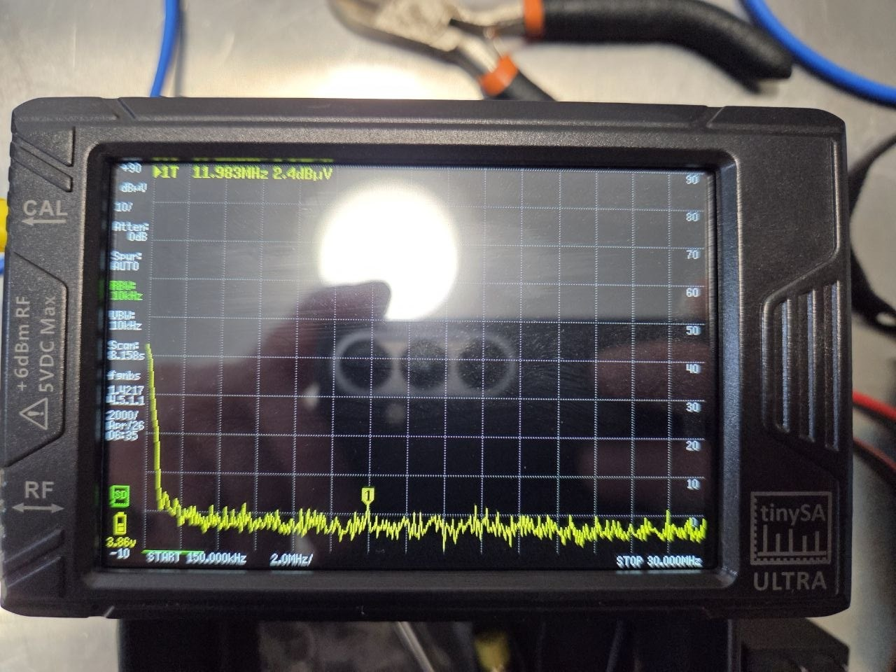
